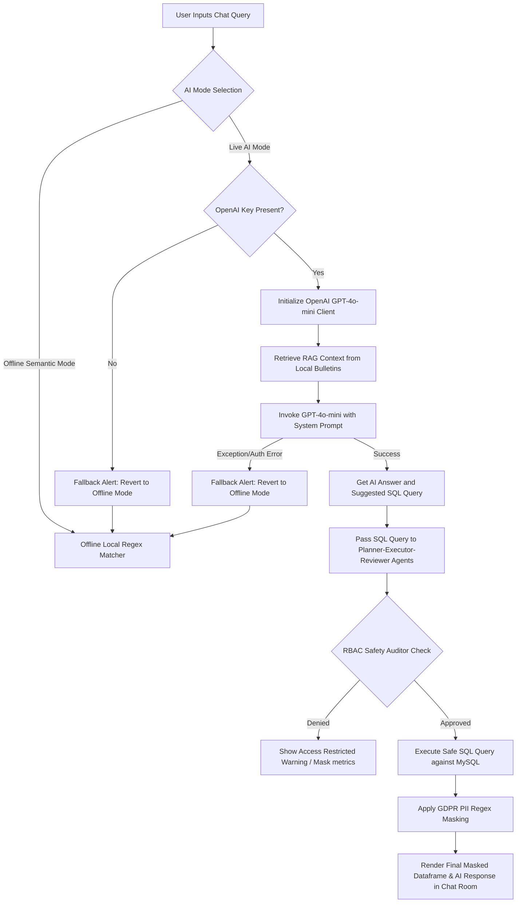

# API Key Ingestion & AI Routing Guide

This guide details the step-by-step process of loading your **OpenAI API Key** into the AI Business InSite Assistant and explains the internal routing, planning, and safety mechanisms.

---

## 📥 Step 1: Loading Your API Key

The application provides two ingestion options located in the sidebar under **Workspace Controls**:

1. **Option A: Paste API Key (Direct Text)**
   - Select **Live AI Mode** under **AI Assistant Mode**.
   - Paste your OpenAI API Key (starting with `sk-...`) directly into the input box labeled *Option A: Paste OpenAI API Key*.
   - The key is dynamically loaded into the environment (`os.environ["OPENAI_API_KEY"]`).

2. **Option B: Upload API Key File (Spreadsheet/Env/Txt)**
   - Save your API key in a standard plain text file (e.g. `api_key.txt` containing just `sk-...`) or a standard environment file (e.g. `.env` containing `OPENAI_API_KEY=sk-...`).
   - Drag and drop or browse to select the file using the *Option B: Upload Key File* drag-and-drop widget.
   - The script automatically parses the key (stripping quotes and prefix keys if in `.env` format) and loads it.

---

## ⚙️ Step 2: How the AI Assistant Routes Queries (Step-by-Step)

The assistant uses a **Dual-Mode NLP Router** to execute natural language queries. Below is the step-by-step execution path:

### Detailed Breakdown of the Steps:

#### 1. Ingestion & Retrieval (RAG Context)
When you submit a question, the assistant first query-searches a local simulated vector database (`query_rag_knowledge_base`) to fetch company bulletins or documentation matching your request (e.g. West region driver strike details, East server outage date).

#### 2. Model Dispatching
- **Live AI Mode**: The assistant calls the `gpt-4o-mini` model, sending the schema details of the MySQL star warehouse, the retrieved RAG contexts, and the current user's role (CEO, Sales Manager, or Operations Manager).
- **Offline Semantic Mode (Fallback)**: If the OpenAI API key is missing or invalid, the system automatically falls back to local regex matching. It identifies keyword triggers (like *forecast*, *segment*, *basket*, *leads*) and executes custom local analytics models directly.

#### 3. Agent Planning & Safety Auditing
The suggested SQL queries are validated through a multi-agent workflow:
- **Planner Agent**: Decomposes the user intent and lists required table objects.
- **Executor Agent**: Checks syntax and runs calculations.
- **Reviewer Agent (RBAC & Sanitizer)**: Checks the user's role permissions (blocks Sales Managers from support logs, blocks Operations Managers from financial columns) and runs a regular expression sanitizer to ensure only `SELECT` (read-only) statements are executed.

#### 4. GDPR Masking & Output Rendering
Before showing any database records, the obfuscator masks name fields (`J***n D***e`), email addresses (`j***e@domain.com`), and phone numbers (`***-***-1234`), rendering a fully secure, SOC2-compliant dataset.

---

## 🛠️ Verification: Testing the Setup

1. **Test Offline Fallback**:
   - Turn on **Live AI Mode** without entering a key, or enter an invalid key (e.g., `sk-invalidkey123`).
   - Submit: *"Forecast sales for next month"*.
   - **Expected Output**: The system registers the warning in stdout, falls back to offline mode, and displays local forecasting stats.

2. **Test Active Live Mode**:
   - Enter a valid OpenAI API key.
   - Submit: *"Show top 5 customers from North region"*.
   - **Expected Output**: Displays a customized chat message from **Live AI Mode (GPT-4o-mini)** showing the generated SQL: `SELECT customer_name, region FROM dim_customers WHERE region='North' LIMIT 5;` with masked names in the table.
